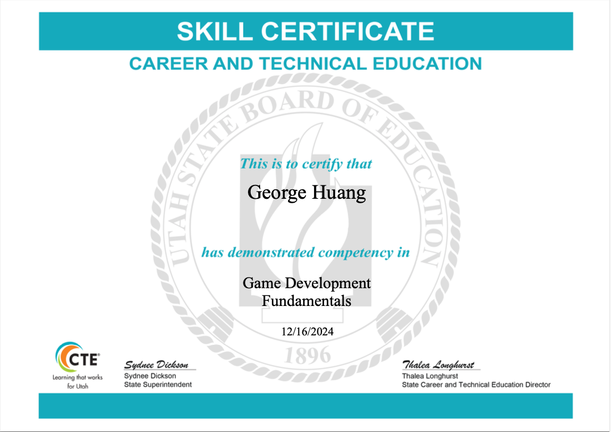
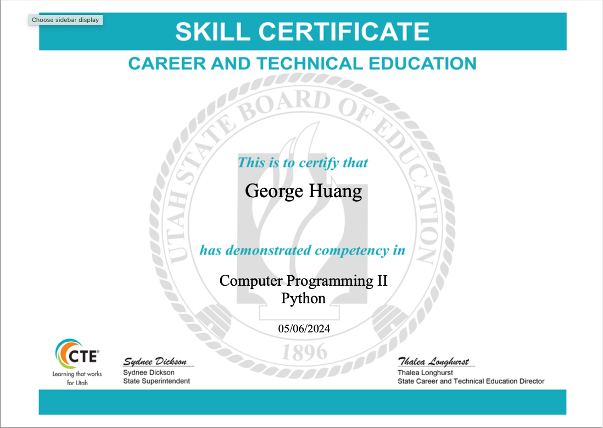
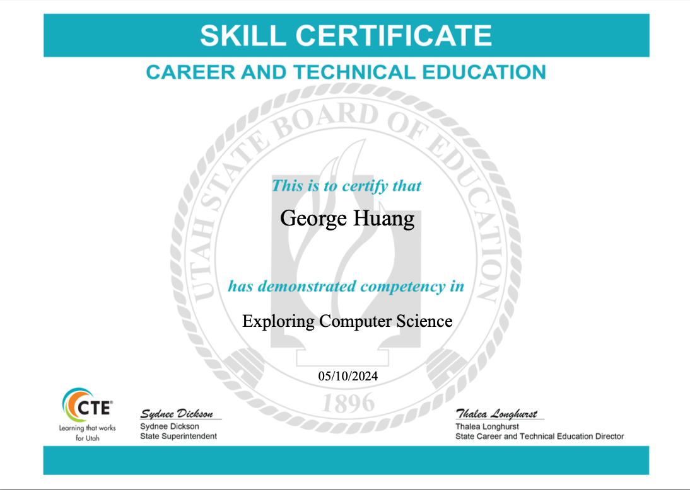
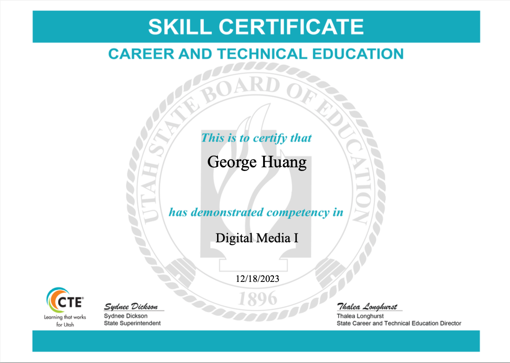
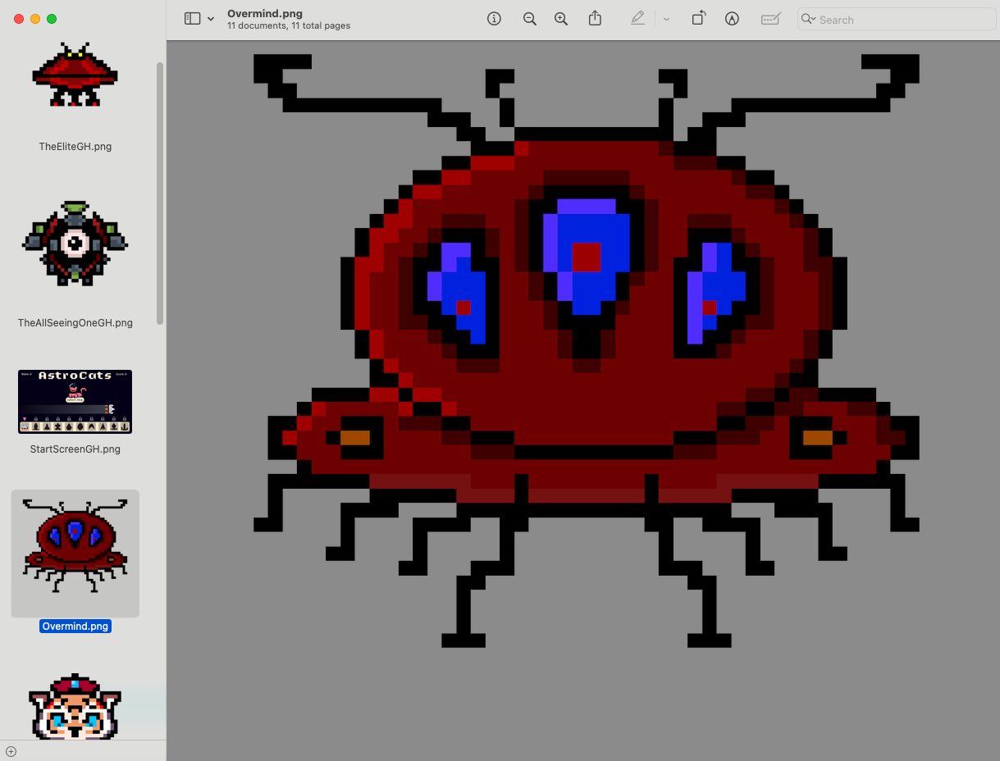
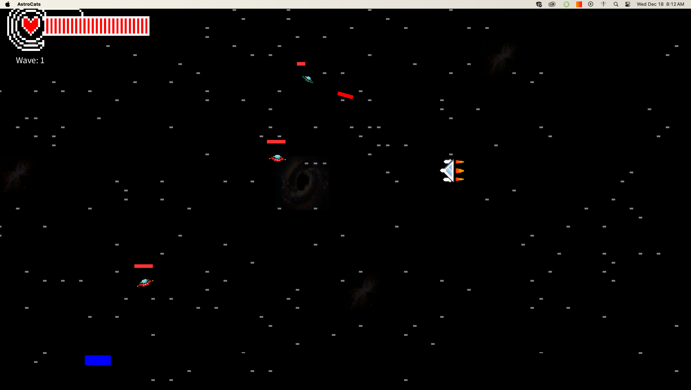

# George Huang's Game Development Portfolio

Hi, I’m George Huang, and game development isn’t just a hobby—it’s a passion that’s been with me for as long as I can remember! My journey began with my younger brother, crafting our own video games in Scratch when we were kids. Those early days sparked a fire in me, fueling my fascination with game design and graphics. This curiosity pushed me to master powerful tools like Adobe Illustrator and Adobe Animate, bringing my creative visions to life. Recently, I’ve also dived into the world of programming, with Python as my first language, adding a new layer of depth to my game development skills.

Here is the link to my brother and I's Scratch page: [https://scratch.mit.edu/users/Omega_Utimate/](https://scratch.mit.edu/users/Omega_Utimate/)
Link to my personal repository: [https://github.com/S-erenity/programmingportfolio]

Email: g89312@hotmail.com

# Technical Certifications

# Individual Projects

## Klix

Welcome to KLIX, the ultimate clicker game where every tap counts! In KLIX, your goal is simple: click the box as many times as possible to rack up points and unlock powerful upgrades. The more clicks you unleash, the faster you progress through the game.

But be warned, the challenge doesn't end with clicking alone. Along the way, you'll encounter various upgrades that enhance your clicking power, allowing you to earn points even faster. As you continue to click your way through the game, you'll unlock badges that showcase your achievements and progress.

Are you ready to embark on a clicking adventure like no other? Get your fingers ready and dive into the addictive world of KLIX!

https://github.com/S-erenity/KLIX

# Group Projects

## AstroCats

In a Universe millions of miles away, a planet known as Felinnea known for its lush landscape and advanced technology a war has erupted and Aliens have invaded. The Alien Mothership has invaded the entire universe and Felinnea is the last planet that hasn’t been conquered by the enemy. Amid the chaos Queen of Felinnea was able to take control of their last ship and send one last Cat warrior into space to ask the human race for help to defeat the aliens and save their planet. Cat is their last chance to save their planet and defeat the aliens. Cat needs all the help it can get to escape the planet and fight off the enemy warships and make it to Earth. It is a race against time and the fight for domination. 

My Role: Graphic Designer & UI Designer

Any images with the initials "GH" is my work and contribution.
https://github.com/RubyJacobsen/GameDevTeam2

## Flappy Bird 2.0

My Role: Graphic Designer & Animator

All game sprites are my contribution.
https://github.com/seanroberts216/GameDev2Team3

